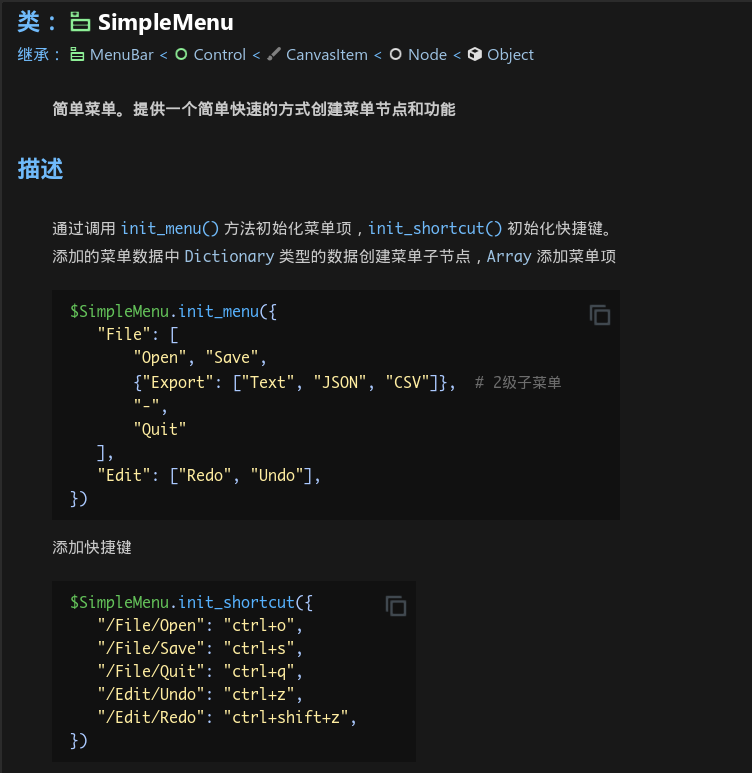
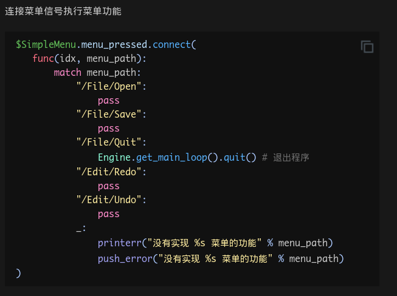
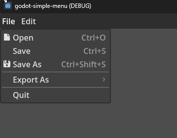

# Godot Simple Menu

[](https://godotengine.org/)
[](https://lbesson.mit-license.org/)

---

document





Easy menu creation function：

```gdscript
func _ready():
    var menu : SimpleMenu = %Menu
    menu.init_menu({
        "File": [
            "Open", "Save", "Save As", "-",
            {"Export As...": [ "Export PNG", "Export JPG" ] }, "-",
            "Quit",
        ],
        "Edit": [
            "Undo", "Redo", "-",
            "Copy", "Cut", "Clear",
        ]
    })

    simple_menu.init_shortcut({
        "/File/Open": SimpleMenu.parse_shortcut("Ctrl+O"),
        "/File/Save": SimpleMenu.parse_shortcut("Ctrl+S"),
        "/File/Save As": SimpleMenu.parse_shortcut("Ctrl+Shift+S"),
        "/Edit/Undo": SimpleMenu.parse_shortcut("Ctrl+Z"),
        "/Edit/Redo": SimpleMenu.parse_shortcut("Ctrl+Shift+Z"),
        "/Edit/Copy": SimpleMenu.parse_shortcut("Ctrl+C"),
        "/Edit/Paste": SimpleMenu.parse_shortcut("Ctrl+V"),
        "/Edit/Cut": SimpleMenu.parse_shortcut("Ctrl+X"),
    })
```

A dictionary is equivalent to a menu, with a list of options and a string of options. Use the menu path for control.



Please refer to the example for details: **addons/simplemenu/example/**
